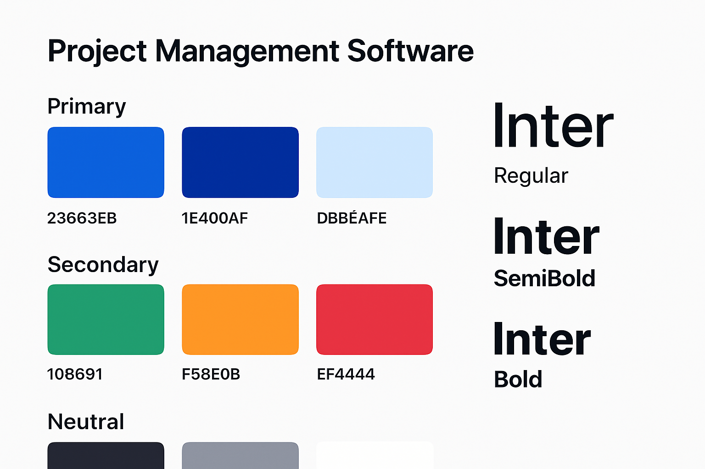

# Project Manager Pro - برنامج إدارة المشاريع



## نظرة عامة

Project Manager Pro هو تطبيق سطح مكتب شامل لإدارة المشاريع ومتابعة المهام، مصمم خصيصاً للفرق والأفراد الذين يسعون لتحسين إنتاجيتهم وتنظيم أعمالهم بكفاءة عالية.

## الميزات الرئيسية

### 📊 لوحة معلومات تفاعلية
- إحصائيات شاملة عن المشاريع والمهام
- مخططات بيانية تفاعلية (دائرية، خطية، عمودية)
- عرض الأنشطة الأخيرة والمهام القادمة
- مؤشرات الأداء الرئيسية (KPIs)

### 🗂️ إدارة المشاريع
- إنشاء وتنظيم المشاريع بسهولة
- تتبع التقدم بصرياً مع شرائط التقدم
- تصنيف المشاريع حسب الأولوية والحالة
- إدارة فرق العمل وتوزيع المهام

### ✅ نظام إدارة المهام
- واجهة Kanban board سهلة الاستخدام
- سحب وإفلات المهام بين الحالات المختلفة
- تحديد الأولويات والمواعيد النهائية
- تعيين المهام لأعضاء الفريق

### 📅 التقويم المتكامل
- عرض المهام والمواعيد النهائية
- تنبيهات وإشعارات ذكية
- تزامن مع التقويمات الخارجية

### 📈 التقارير والتحليلات
- تقارير مفصلة عن الأداء
- تحليل إنتاجية الفريق
- إحصائيات زمنية للمشاريع
- إمكانية تصدير التقارير

## التقنيات المستخدمة

- **Frontend**: React 18 + TypeScript
- **Desktop Framework**: Electron
- **UI Components**: Custom components with modern design
- **Charts**: Recharts
- **Icons**: Lucide React
- **Styling**: CSS3 with CSS Variables
- **Build Tool**: React Scripts + Electron Builder

## متطلبات النظام

### الحد الأدنى
- **ويندوز**: Windows 10 (64-bit)
- **ماك**: macOS 10.15 (Catalina)
- **الذاكرة**: 4 GB RAM
- **التخزين**: 500 MB مساحة فارغة

### الموصى به
- **الذاكرة**: 8 GB RAM أو أكثر
- **التخزين**: 1 GB مساحة فارغة
- **الشاشة**: 1920x1080 أو أعلى

## التثبيت

### التحميل
قم بتحميل أحدث إصدار من [صفحة الإصدارات](releases):
- **ويندوز**: `Project-Manager-Pro-Setup.exe`
- **ماك**: `Project-Manager-Pro.dmg`
- **لينكس**: `Project-Manager-Pro.AppImage`

### التثبيت السريع
1. قم بتحميل الملف المناسب لنظام التشغيل
2. اتبع تعليمات التثبيت
3. شغل التطبيق واستمتع بإدارة مشاريعك!

للحصول على تعليمات مفصلة، راجع [دليل التثبيت](./docs/installation_guide.md).

## الاستخدام

### البدء السريع
1. **إنشاء مشروع جديد**: انقر على "مشروع جديد" وأدخل التفاصيل
2. **إضافة مهام**: أنشئ مهام وعينها لأعضاء الفريق
3. **متابعة التقدم**: استخدم لوحة المعلومات لمراقبة الأداء
4. **إدارة المهام**: استخدم Kanban board لتنظيم سير العمل

للحصول على دليل شامل، راجع [دليل المستخدم](./docs/user_guide.md).

## هيكل المشروع

```
project_management_app/
├── public/                 # ملفات Electron الأساسية
│   ├── electron.js        # العملية الرئيسية
│   ├── preload.js         # سكريبت preload
│   └── index.html         # HTML الأساسي
├── src/                   # كود React
│   ├── components/        # مكونات React
│   ├── pages/            # صفحات التطبيق
│   ├── styles/           # ملفات CSS
│   ├── types/            # تعريفات TypeScript
│   └── utils/            # وظائف مساعدة
├── docs/                 # التوثيق
├── design_assets/        # ملفات التصميم
├── wireframes/          # مخططات الواجهة
└── dist/                # ملفات البناء النهائية
```

## التطوير

### متطلبات التطوير
- Node.js 18 أو أحدث
- npm أو yarn

### إعداد بيئة التطوير
```bash
# استنساخ المشروع
git clone <repository-url>
cd project_management_app

# تثبيت التبعيات
npm install

# تشغيل في وضع التطوير
npm start

# بناء للإنتاج
npm run build

# إنشاء ملف تنفيذي
npm run electron-pack
```

## المساهمة

نرحب بمساهماتكم! يرجى اتباع الخطوات التالية:

1. Fork المشروع
2. إنشاء branch جديد (`git checkout -b feature/amazing-feature`)
3. Commit التغييرات (`git commit -m 'Add amazing feature'`)
4. Push إلى Branch (`git push origin feature/amazing-feature`)
5. فتح Pull Request

## الترخيص

هذا المشروع مرخص تحت رخصة MIT - راجع ملف [LICENSE](LICENSE) للتفاصيل.

## الدعم

للحصول على المساعدة والدعم:
- 📧 البريد الإلكتروني: support@projectmanagerpro.com
- 🌐 الموقع الإلكتروني: www.projectmanagerpro.com
- 📖 التوثيق: [دليل المستخدم](./docs/user_guide.md)

## الشكر والتقدير

- شكر خاص لجميع المساهمين في هذا المشروع
- مكتبة React وفريق Electron للأدوات الرائعة
- مجتمع المطورين العرب للإلهام والدعم

---

**تم التطوير بواسطة Manus AI** 🤖

*"إدارة مشاريع أذكى، إنتاجية أعلى"*


## البناء التلقائي والتوزيع

### GitHub Actions
تم إعداد نظام بناء تلقائي متطور باستخدام GitHub Actions ينتج ملفات تنفيذية لجميع المنصات:

#### الملفات المُنتجة تلقائياً:
- **ويندوز**: `.exe` (NSIS), `.msi`, `.zip`
- **ماك**: `.dmg`, `.zip` (Intel + Apple Silicon)
- **لينكس**: `.AppImage`, `.deb`, `.rpm`, `.tar.gz`

#### كيفية الاستخدام:
```bash
# 1. رفع الكود إلى GitHub
git push origin main

# 2. إنشاء إصدار جديد
git tag v1.0.0
git push origin v1.0.0

# 3. انتظار اكتمال البناء (10-15 دقيقة)
# 4. تحميل الملفات من صفحة Releases
```

### البدء السريع
راجع [دليل البدء السريع](./QUICK_START.md) للحصول على تعليمات مفصلة.

### التوثيق الإضافي
- [دليل GitHub Actions](./docs/github_actions_guide.md)
- [دليل النشر والتوزيع](./docs/deployment_guide.md)
- [دليل التثبيت](./docs/installation_guide.md)

## الحالة الحالية


### الإصدار الحالي: v1.0.0
- ✅ واجهة مستخدم كاملة
- ✅ لوحة معلومات تفاعلية  
- ✅ إدارة المشاريع والمهام
- ✅ نظام Kanban
- ✅ تصميم متجاوب
- ✅ بناء تلقائي لجميع المنصات

### الإصدارات القادمة
- 🔄 قاعدة بيانات محلية
- 🔄 تزامن سحابي
- 🔄 تقارير متقدمة
- 🔄 إشعارات ذكية

